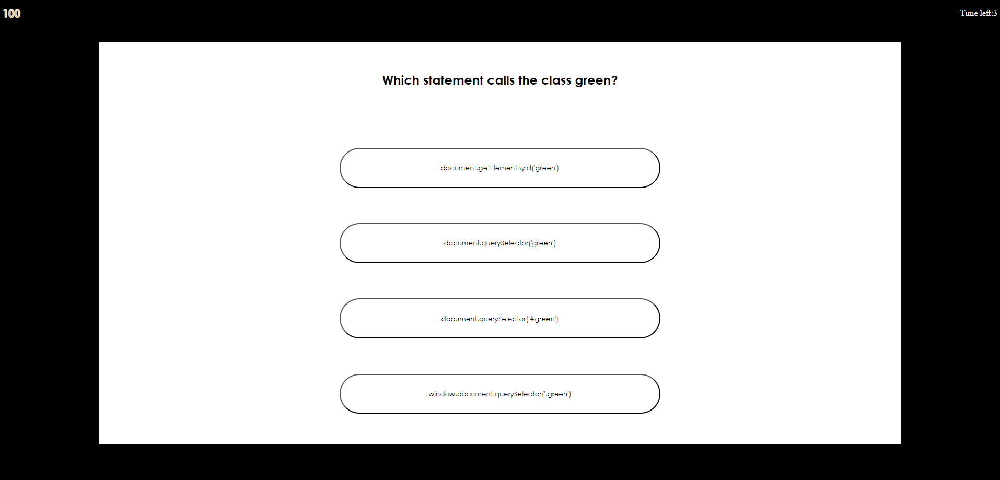

# Timed Quiz

## Description

The challenge for this assignment was to write a program that functions as a coding assessment. The webpage includes a quiz on coding topics and a score dashboard which saves user scores. This challenge features dynamically updated HTML and CSS that is powered by Javascript.

In this project I learned how to practice:
- Web APIs: to traverse the DOM
- Events: utilizing addEventListener() to handle click events
- Local Storage: to store data in the user's browser.
- JSON: to convert object data to and from local storage.

## Installation

N/A

## Usage

Click [Here](https://afrazier01.github.io/Timed-Quiz/) to go to my deloyed webpage. You can begin by clicking the 'Start Timer' button and answering the questions. When the quiz is complete, your score will be displayed and you can add a username to the score dashboard before playing again!

Once the webpage is open, view logged messages and variables to console by using Chrome DevTools. Right-click and select inspect; or for windows - Control + Shift + I and for MacOS - Command + Option + I. Navigate to the the console tab to observe how the webpage is functioning.

Here is a look at the deployed webpage:

## Credits

N/A

## License

Please refer to the LICENSE in the repo.

